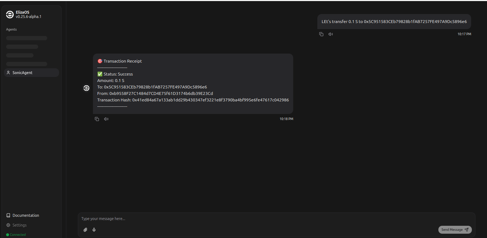
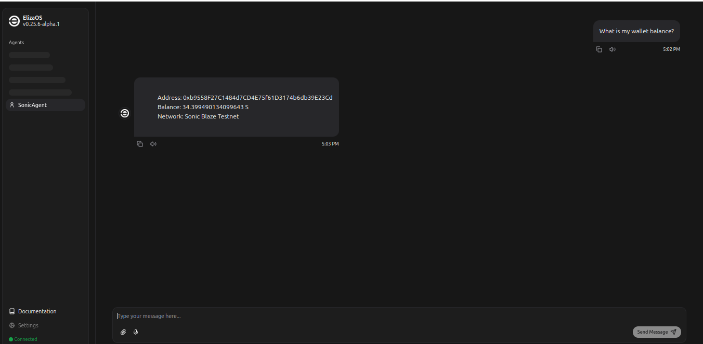

# @elizaos-plugins/plugin-sonic

Core Sonic blockchain plugin for Eliza OS that provides essential services and actions for token operations, trading, and DeFi integrations.

## Overview

The Sonic plugin serves as a foundational component of Eliza OS, bridging Sonic blockchain capabilities with the Eliza ecosystem. It provides crucial services for token operations, trading, portfolio management, and DeFi integrations, enabling both automated and user-directed interactions with the Sonic blockchain.

## Features

### Token Operations

- **Token Transfers**: Send Sonic native token S.
- **Balance**: Get token balances

## Future Enhancements

### Wallet Provider

- **Wallet Provider**: Implement wallet provider

### Trading Operations

- **Token Swaps**: Execute trades between tokens using Jupiter aggregator
- **Order Management**: Place and track token orders
- **Price Monitoring**: Real-time price feeds and historical data
- **Automated Trading**: Configurable trading strategies and automation

### DeFi Integration

- **Liquidity Analysis**: Monitor and analyze pool liquidity
- **Market Making**: Automated market making capabilities
- **Yield Optimization**: Smart routing for optimal yields
- **Risk Management**: Advanced risk scoring and monitoring

### Trust & Security

- **Trust Scoring**: Dynamic trust score calculation for tokens
- **Risk Assessment**: Real-time risk evaluation for trades
- **Performance Tracking**: Historical performance monitoring
- **Simulation Mode**: Test strategies without real transactions

```bash
npm install @elizaos-plugins/plugin-sonic
```

## Configuration

Configure the plugin by setting the following environment variables:

```typescript
const sonicEnvSchema = {
  SONIC_WALLET_PRIVATE_KEY: string,
  SONIC_RPC_URL: string,
};
```

## Usage

### Basic Setup

```typescript
import { sonicPlugin } from "@elizaos-plugins/plugin-sonic";

// Initialize the plugin
const runtime = await initializeRuntime({
  plugins: [sonicPlugin],
});
```

### Send Token

Transfer SONIC tokens to another address:

```typescript
// Example conversation
User: "Send 1 SONIC to 0x5C951583CEb79828b1fAB7257FE497A9Dc5896e6";
Assistant: "I'll send 1 SONIC token now...";
```



### Check Wallet Balance

Query wallet balance:

```typescript
// Example conversation
User: "What's balance of my wallet 0x5C951583CEb79828b1fAB7257FE497A9Dc5896e6";
Assistant: "Your wallet contains 4.6 S";
```



## Actions

### transferToken

Transfers tokens between wallets.

```typescript
// Example usage
const result = await runtime.executeAction("TRANSFER_TOKEN", {
  recipient: "RecipientAddressHere",
  amount: "1000",
});
```

### getBalance

## Safety & Security

### Best Practices

1. **Environment Variables**

   - Store sensitive keys in environment variables
   - Use .env.example for non-sensitive defaults
   - Never commit real credentials to version control

## Support

For issues and feature requests, please:

1. Review existing GitHub issues
2. Submit a new issue with:
   - System information
   - Error logs
   - Steps to reproduce
   - Transaction IDs (if applicable)

For direct support, reach out on Discord: @thopate_vijay

For more information about Sonic blockchain capabilities:

- [Sonic Documentation](https://docs.soniclabs.com/)
